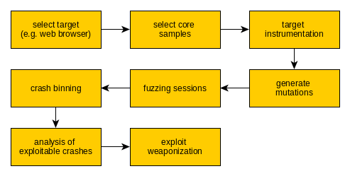
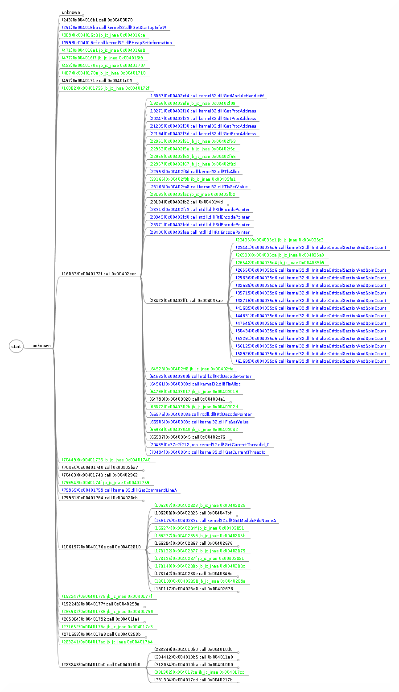

# hunter-seeker
Fuzzing/instrumentation framework based on eqmu emulation/virtualization and compatible with x86 Windows guest operating systems.

## Concept
The original idea for hunter-seeker (HS) framework was based on research into fuzzing, instrumentation, automation, binning crashes and taint analysis that was lead I belive by Charlie Miller and/ir Ben Nagy (can't remember exactly now, apologies). It involved qemu variant hacked for propagating taint (temu/bitblaze (?)). 

Let's start from the end :).
The goal of the bug hunting process is a weaponized exploit ready for submission in a vuln aquisition program. 
In order to produce a weaponized exploit, exploitable crash must be available and a toolset for engineering the shellcode and a payload. I belive the best tool for this should rely on taint analysis.
In order to produce an exploitable crash, a number of ordinary crashes should be generated and binned
In order to produce a number of crashes, analysis sunject needs to be instrumented for exception detection and repeated processing of a mutated sample should be performed
In roder to produce mutated samples, core samples need to be chosen based on the code coverage (code of new features and code working on input data (processing files, serving protocol requests) has high potential)

So the overall process of bug hunting can be summarized as:

### Improving the process

The idea is to build upon this foundation but improve on speed. There were several milestones in the roadmap:
1. Scripting language for instrumentation ([Chakobsa](https://github.com/ishish222/hunter-seeker/blob/master/doc/08_specification_chakobsa.txt)). Should allow flexible instrumentation of the guest machine including process management, programming the local tracer behavior (see architecture), basic control flow (loops, conditions), etc.
2. Recording execution traces for further analysis (see: Execution traces)
3. Correctors and mutators for overcoming low barriers of bug hunting (see: low barriers)
4. Pluggable Machine Language models for mutators to generate
5. Automated crash binning
6. Taint analysis tool with interactive CLI
7. Speed up the process using new Intel's processor's feature - TRACE [anchor]

### Hunter Seeker architecture

The fuzzing / analysis session has the following architecture:

The HS's external controller is being run with qemu machine drive (qcow2 format) and Chakobsa script as parameters. External controlled executes the script and the usual actions are: 
- Spinning up qemu machine with indicated drive as its main drive (1)
- Loading VM snapshot with target application installed
- Starting target application in the debug mode (2) 
- Setting up tracer's reactions
- Mounting external drive with samples via the mutator module (3, 4)
- Releasing the execution 
- Triggering sample processing by targetapplication (e.g. via "double-clicking" it)

If an unhandled exception is caught, the sample is being recorded as a crash for further analysis.

## Chakobsa

The current implementation of the Chakobsa language allows for:
- Configuring the environement (input / output dirs)
- Managing the qemu imeages (loading/saving machine states)
- Starting Qemu with specific configurations
- Starting internal controller
- Executing interaction scripts (e.g. emulating user clicking mouse buttons or typing on the keyboard)
- Extracting data from PE headers of executables / libraries
- Registering instrumentation reactions

## Instrumentation reactions

Instrumentation reaction means various regions of memory in the target application are identified, marked and the opcode in this memory is replaced by the processor's breakpoint instruction (a standard bahavior of a debugger). Once the processor executed the breakpoint opcode ("the execution hits the mark"), the original opcode is retrieved and the control is handed over to the external controller for decision-making. 

The external controller decide on further steps based on the mark being hit. For example, if the mark is hit signifying complete execution of the samples (e.g., image loaded in an image viewer) it means that the sample did not trigger unhandled exception. Therefore it can be discarded and another sample can be scheduled for processing. If an entry point of a code that is subject to analaysis is hit, the controller might decide on the memory dump and commencing detailed execution recording [anchor Recorded execution traces].

## Recorded execution traces

Execution traces are files with recorded sequences of instructions that have been executed by the guest processor. Every thread that has been marked for recording has a separate trace file . This information combined with the memory dump allows for "replaying" execution for analysis purposes. A set of tools can be used for:

1. Drawing call graph (see: taint/call_analyze.c)
2. Taint analysis (see: taint/taint_analyze.c)
3. Other types of analysis (like code coverage analysis)

## Low barriers

Based on my knowledge the idea ofa low barrier is not a widely recognized concept, but it's simple. Low barrier is a security control within a target application that aim's at preventing the software from processing malformed input. Usually it relies on checksums or cryptographic hashed. E.g., if a sample is mutated by bit-flipping at a random position in a document, the checksum or the hash is no longer correct. Based on this, internal logic of the target software prevents further processing of data that is deemed malformed.

The way to overcome low barrier is to reverse analyse the procedure and come up with correction scripts that re-calculate and update these checksums or hashes. In my experience in many applications there are no more controls and they become very vulnerable.

## Intel's TRACE

Further improvements in the fuzzing process can be achieved by the [PT TRACE](https://www.intel.com/content/www/us/en/developer/videos/collecting-processor-trace-in-intel-system-debugger.html) technology present in the Intel's processors. While this feature is being leveraged in other fuzzers (AFL) I was unable to combine them with VM management processor features which renders them unusable for the time being due to lack of scaling.

## Components

1. External controller (Python): [External controler](https://github.com/ishish222/hunter-seeker/tree/master/local/fuzzers)
2. Internal controller / tracer (C): [Tracer](https://github.com/ishish222/hunter-seeker/tree/master/local/tracer_c)
3. Taint analysis / trace analysis (C): [Taint](https://github.com/ishish222/hunter-seeker/tree/master/local/taint)

### Examples

## Chakobsa scripts

Please see: [hunter-seeker-chakobsa](https://github.com/ishish222/hunter-seeker-chakobsa)

## Malware analysis session

Please see: [doc/movies/demo_hs.mkv](https://github.com/ishish222/hunter-seeker/blob/master/doc/movies/demo_hs.mkv)
Resulting graph: 

## Fuzzing session

Please see: [doc/movies/demo_hs_2.mkv](https://github.com/ishish222/hunter-seeker/blob/master/doc/movies/demo_hs_2.mkv)
